# Setting up your Modernapps Ninja Contributor Repository

**Contents:**

- [Step 1: About ModernApps Ninja Contributor Repository and Portfolio]()
- [Step 2: Request your contributor Repository]()
- [Step 3: Configure your contributor portfolio]()

## Step 1: About ModernApps Ninja Contributor Repository and Portfolio

#### 1.1 The ModernApps Ninja Contributor Repository Service provides a dedicated repository for any participant in the ModernApps Ninja community. A contributor repository is required to recieve a certificate of completion for [modernapps.ninja](https://modernapps.ninja) courses that offer certificates of completion. 

Note that it is called a contributor repository and not a student or participant repository because all participants who complete course requirements provide meaningful contributions to the community as a core part of their learning experience and can rightfully consider themselves to be contributors to the community. 

The Contributor repository serves both as a location where participants can practice gitops skills and also post assignments and course completion records, which act as part of the proof of completion required to validate completion certificate requests. 

The Contributor repository also includes a portfolio website that displays a nicely organized page to display your modernapps.ninja course completion certificates, records, and contributions. 

## Step 2: Request your contributor Repository

#### 2.1 In a web browser, navigate to [https://github.com/modernappsninjas/dojo/issues](https://github.com/modernappsninjas/dojo/issues), and select the `New Issue` button to open an issue ticket.

Screenshot 2.1

#### 2.2 Select the `Contributor Repo Request` issue ticket template

Screenshot 2.2

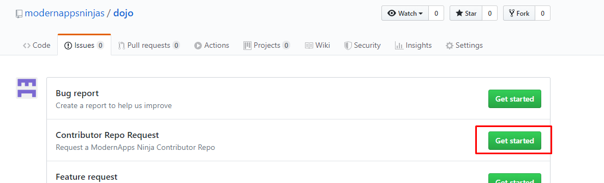

#### 2.3 Fill out the `Contributor Repo Request` form and click `Submit new issue`

Use the title: `Contributor Repo Request for {Github UserID}` - using your github ID

Review the instructions in the request form, fill in your github ID and email address per the instructions in the form, and click `Submit new issue`

Screenshot 2.3

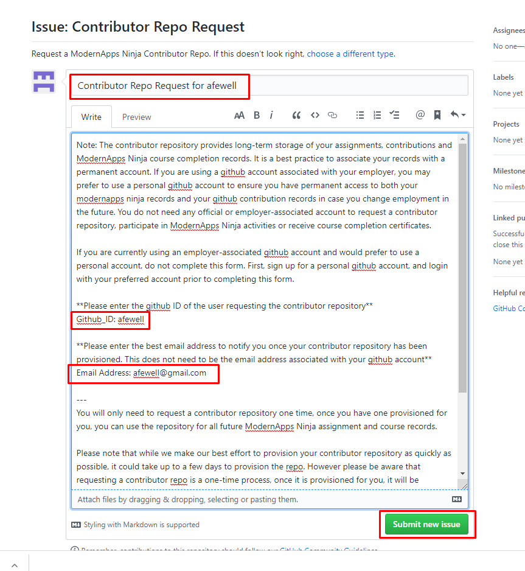

#### 2.4 Wait for your repo to be provisioned

Please note that while we make our best effort to provision your contributor repository as quickly as possible, it could take up to a few days to provision the repo. However, please be aware that requesting a contributor repo is a one-time process, once it is provisioned for you, it will be immediately usable for your ongoing needs.

Once we are able to review your request and provision your contributor repo, we will send an email to the provided email address with details and further instructions for accessing your contributor repository. 

**You will not be able to proceed to Step 3 until your repository has been prepared. Please come back to this page, and proceed with step 3 once you have recieved the email with confirmation of your repository setup.** 

## Step 3: Configure your contributor portfolio

Each course that provides a certificate of completion will provide instructions on where and what files you will need to save in your repository to meet course completion requirements. 

In this step, you will setup the initial configuration for the repository and setup github pages to display the contents of the https://github.com/modernappsninjas/<yourGithubUsername>/docs/ directory of youre repository which will be viewable at the url https://modernappsninjas.github.io/<yourGithubUsername>. 

For example, you can view the ModernApps Ninja portfolio for github user "Oni-no-Hanzo" at the url [https://modernappsninjas.github.io/Oni-no-Hanzo](https://modernappsninjas.github.io/Oni-no-Hanzo)

### 3.1: Configure your repository for github pages

#### 3.1.1 Navigate to the settings page of your contributor repository at https://github.com/modernappsninjas/<yourGithubUsername>/settings, using your github username

On your settings page, scroll down to the `Github Pages` section, and under `Source`, select `master branch /docs folder`

Screenshot 3.1

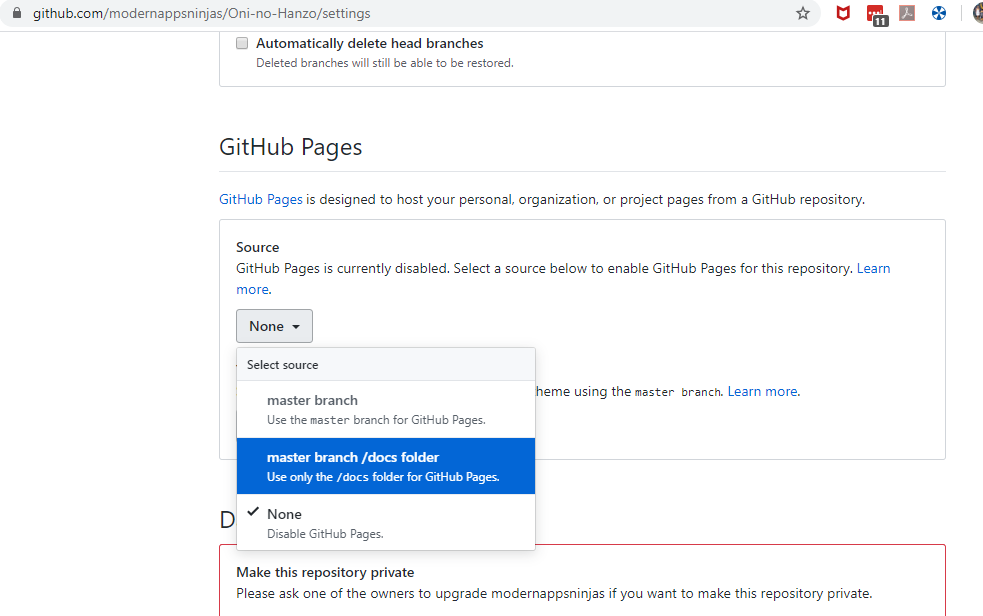

 

After you select the source value, the setting will automatically apply, you do not need to press any other button to confirm. 

#### 3.1.2 View your new github page

On the settings page for your contributor repository, navigate to the `Gihub Pages` section, and as soon as you site is ready, you should see a link provided to your new page as showin in the screenshot below. Click on the link to view your new sample provile page

Screenshot 3.1.2.1

Screenshot 3.1.2.2

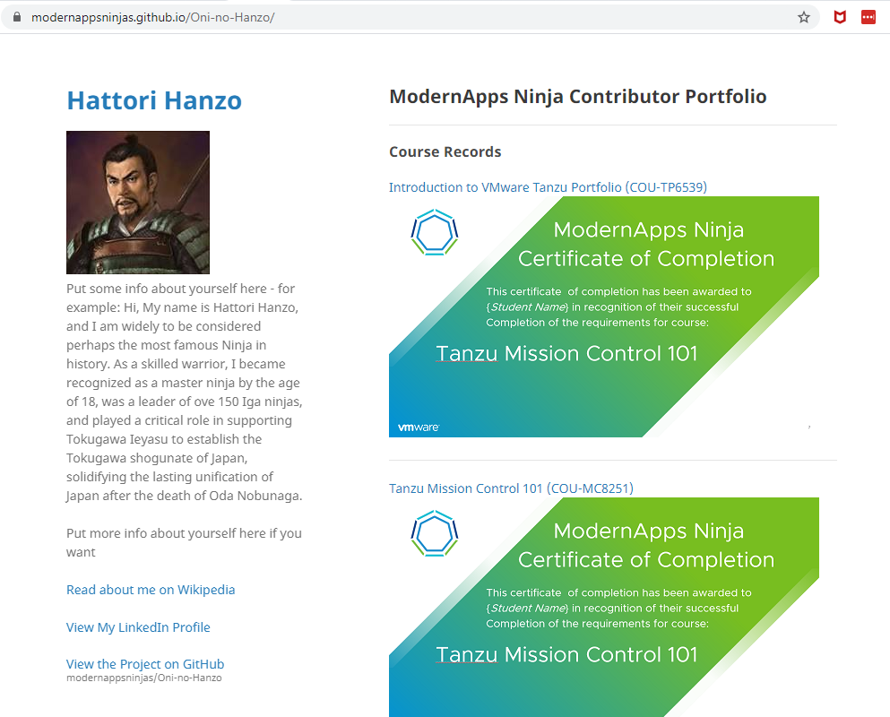

 

### 3.2 Edit your repositories github root readme file

#### 3.2.1 Navigate to your contributor repository on github at https://github.com/modernappsninja/<yourGithubUsername> and update your github root readme.md file

Github.com will display the contents of a file named README.md in the web browser when you navigate to a repository root or subdirectory if there is a file named readme.md present. It is a good practice to set up the readme file in the root of your repository with some basic information. There is no required format for the root readme file, you can set it up however you would like, or not change it at all. 

#### 3.4 Scroll down to the README.md viewer and click the pencil icon in the upper right hand corner of the viewer window to edit the file, as shown in the image below. 

Screenshot 3.2.1

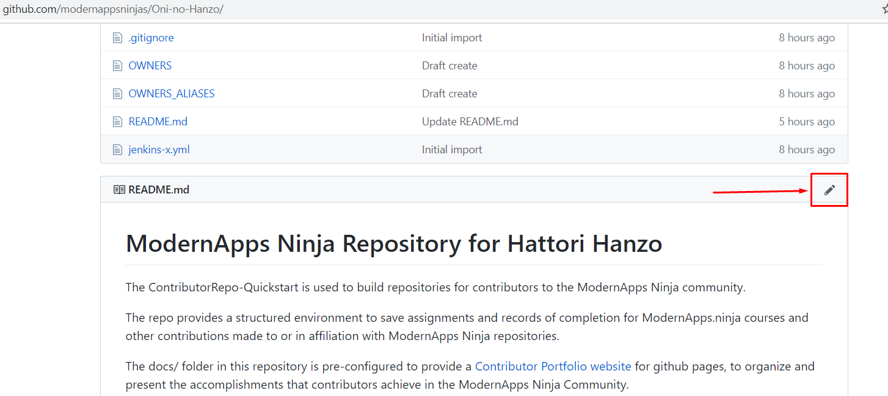

#### 3.2.2 After you have edited the readme file with your desired changes, scroll down to the `Commit Changes` section and select the option to `Create a new branch`, set the branch name as `my-branch-1` and click `Propose file change`

Screenshot 3.2.2

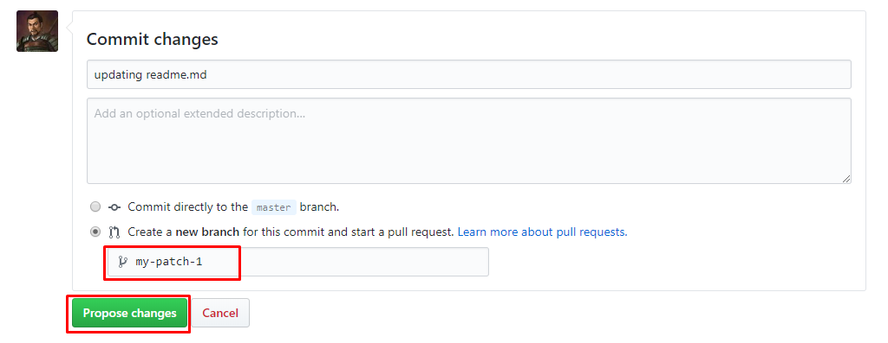

#### 3.2.3 On the `Open a pull request` screen, click `Create pull request`

Screenshot 3.2.3

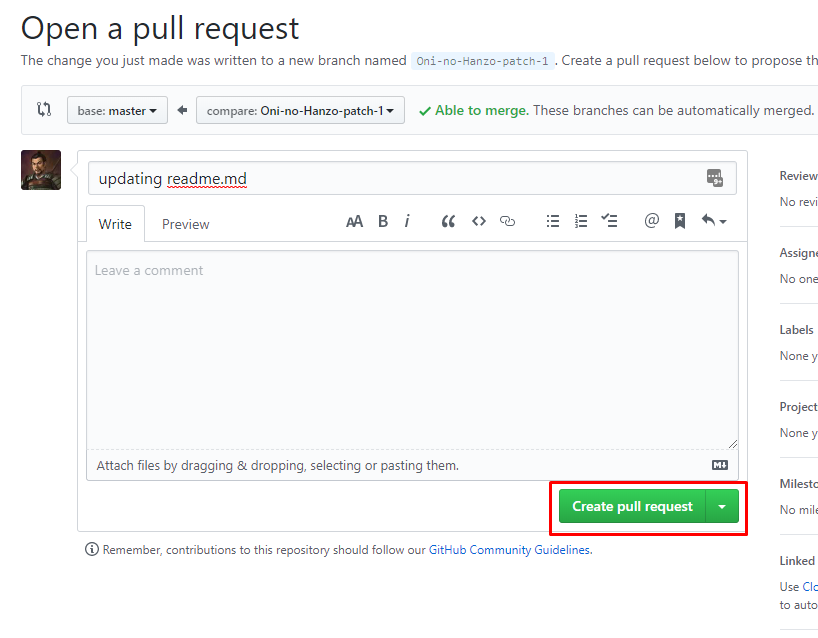

#### 3.2.4 On the pull request page, click the link to `updating readme.md` to see an outline of the changes you proposed. It is ALWAYS a good practice to click this link and examine the file changes to ensure the proposed changes are exactly what you expect. Note that the lines in green are lines that will be added if approved, and the lines displayed in red are the lines that will be deleted if approved.

Screenshot 3.2.4.1

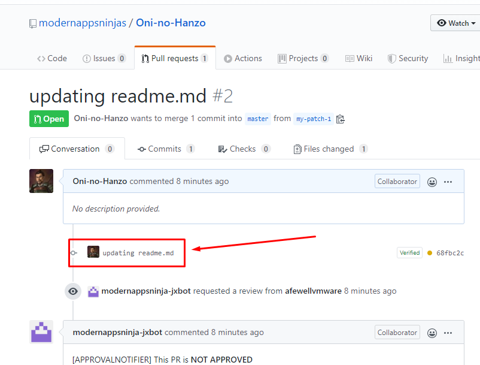

Screenshot 3.2.4.2

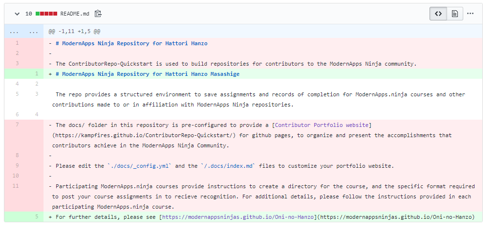

#### 3.2.5 Click the back button on your browser to return to the pullrequest screen. Scroll to the bottom of the page, and ensure the `pr-build` value is set to `All Tasks have completed executing`, or if pipeline tasks are still running, wait until tasks have completed executing before proceeding. 

In the comment box on the bottom of the page, type `/approve` and then click the `Comment` button.

Screenshot 3.2.5

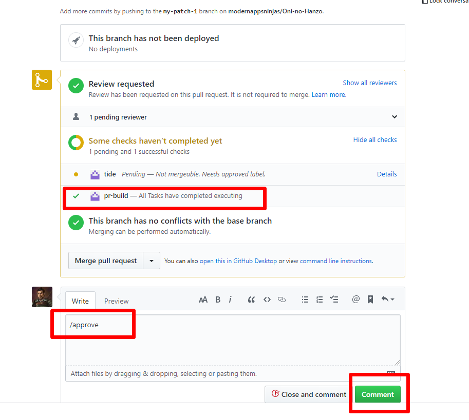

#### 3.2.6 Observe after you click the commit button, you will see some updates being made to your page while the modernapps ninja tekton pipelines process your approval. 

Generally the pipelines take about a minute or two to complete, once the pipeline is done processing, you will see a message that says your pull request has been merged and you can delete the branch. 

Click the button to delete the my-patch-1 branch since you have now finished approving all the changes you made on that branch. 

Screenshot 3.2.6

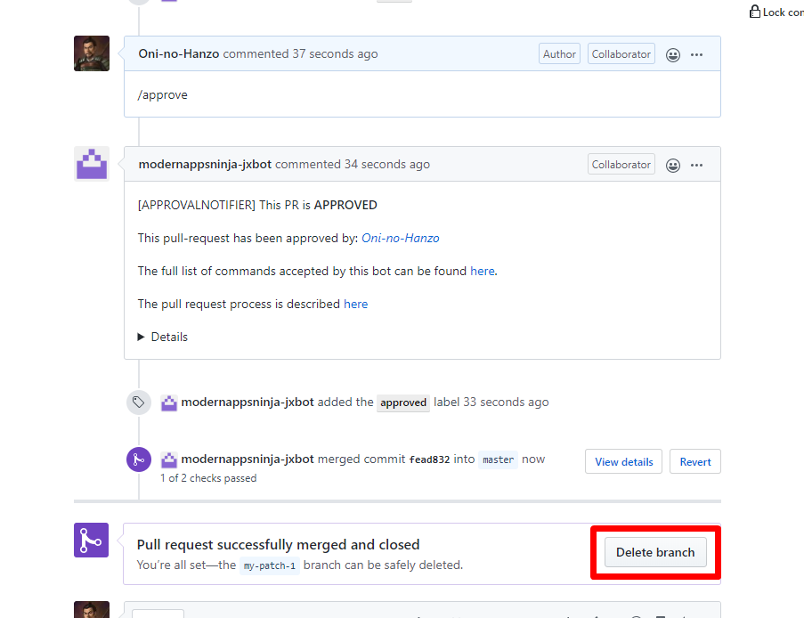

#### 3.2.7 It is possible to simply press `merge pull request` to approve your changes, however we recommend using the method above as your repo has been preconfigured to run a processing pipeline that provides several features, including providing a release, version number and git tag for each approved change. 

You can observe the releases by going to the homepage for your repository, and clicking on the `Releases` tab. 

Screenshot 3.2.7.1

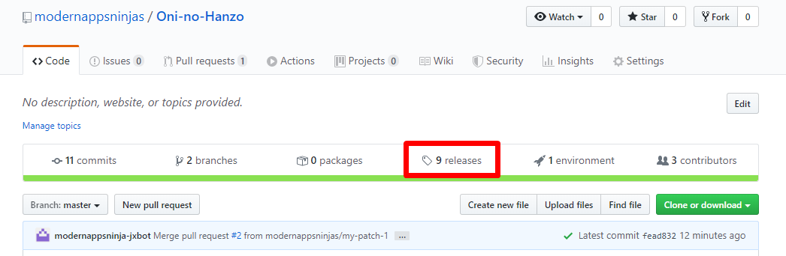

Screenshot 3.2.7.2

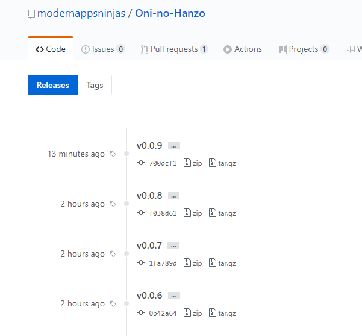

### 3.3: Configure source files for your github page

In your contributor repository, the `_config.yml` and `index.md` files located in the  https://github.com/modernappsninjas/<yourGithubUsername>/docs/ are the primary pages responsible for producing your modernapps ninja github page (https:modernappsninjas.github.io/<yourGithubUsername>). In this step you will modify these files with your own information.

#### 3.3.1 Prepare an image on your local machine that you would like to use as your profile picture, and save the picture with the file name `my_image.png` on your computers local harddrive. 

#### 3.3.2 Navigate to the `/docs/images/` directory in your repository and execute the following actions:

- Click the `Upload files` button
- Select your `my_image.png` file
- In the `Commit Changes` section:
  - Set the commit description to `uploading profile image`
  - Select the option to `Create a new branch`
  - Name the branch `my-patch-1`
  - Click `Propose Changes`
- On the `Open a pull request` screen, click `Create pull request`

Screenshot 3.3.2.1

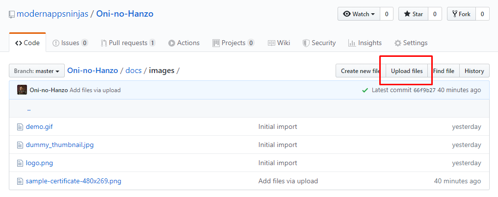

Screenshot 3.3.2.2

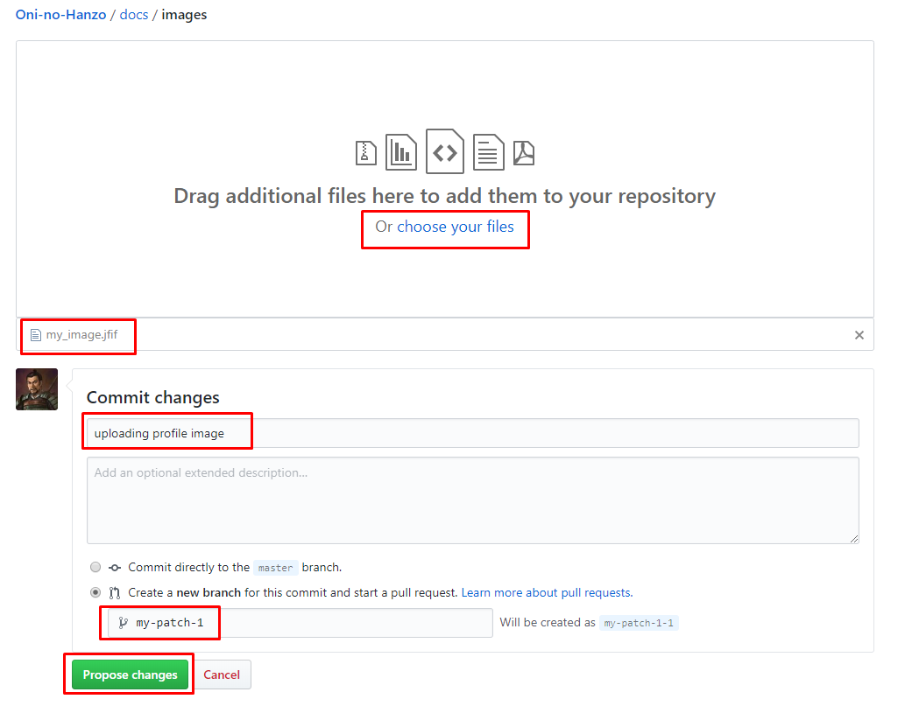

Screenshot 3.3.2.3

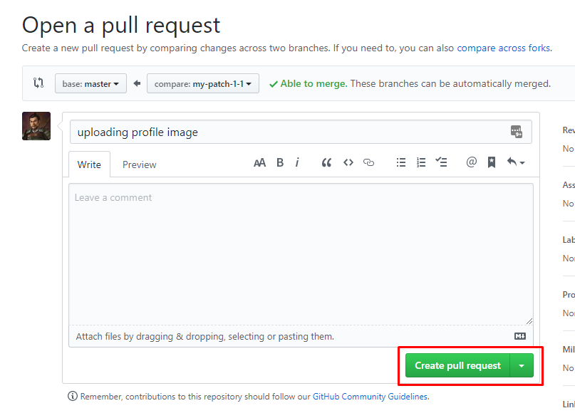

#### 3.3.3 On the PullRequest screen, review your changes, then scroll to the bottom of the pullrequest page and execute the following actions

- Ensure that the value for `pr-build` is `All Tasks have completed executing` 
- In the comment box, type `/approve` and then click the `Comment` button
- Wait for the modernappsninja-jx-bot to process your approval (less than 2 minutes)
- Once the page shows that the merge has been completed, an option to delete branch will appear
- Click `Delete branch`

#### 3.3.4 Navigate to the `/docs/` directory in your repository, click on the `_config.yml` file. Open a seperate browser tab to your github.io portfolio page at https://modernappsninjas.github.io/<yourGithubUsername>. Observe that the `_config.yml` page includes some html tags, and much of the same text that you see on the lefthand side of your github.io portfolio page. 

You do not need to know much about HTML tags to properly edit this page, you can simply edit the plain text in the `_config.yml` file without changing any of the html tags, and the page will be updated with your text in place of the text that is currently displayed in your github.io portfolio page.

Screenshot 3.3.4

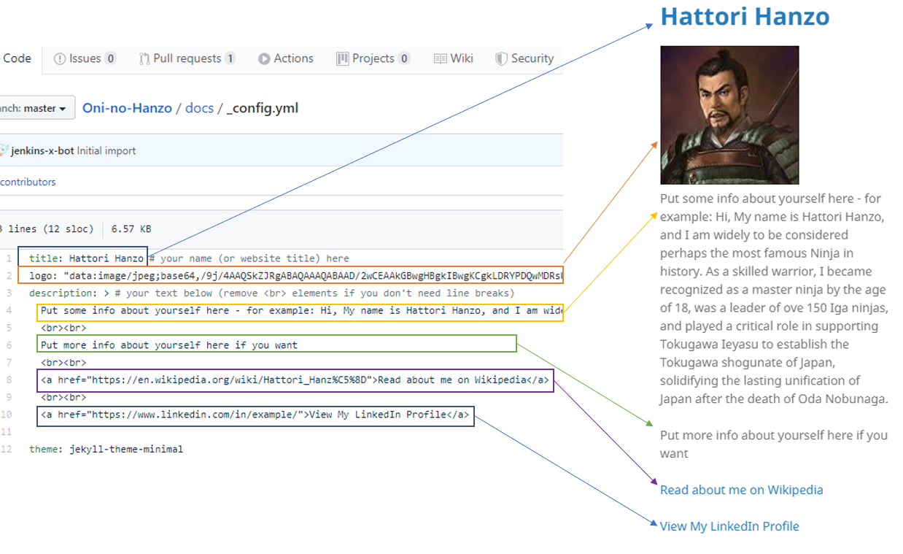

#### 3.3.5 In your repository, click on the pencil in the upper right hand corner to edit the `_config.yml` file. Update the text per the following instructions, referencing the above image from the previous step:

- Line 1: Enter your name as the title
- Line 2: Replace the text on line 2 with the following:
  - `logo: "images/my_image.png?raw=true"
- Line 4: Replace the text with information about yourself
- Line 6: Replace the text with information about yourself
- Line 8 and 9: Delete the text from line 8 and 9
- Line 10: Update the linkedin link with the url to your linkedin profile
- If you would like, add additional links or data
- Once you are done making changes, in the `Commit changes` section
- Set the description to "updating profile contents'
- Select `Create a new branch ...`
- Leave the default name for the new branch
- Click `Propose File Change`
- Click `Create pull request`

Screenshot 3.3.5.1

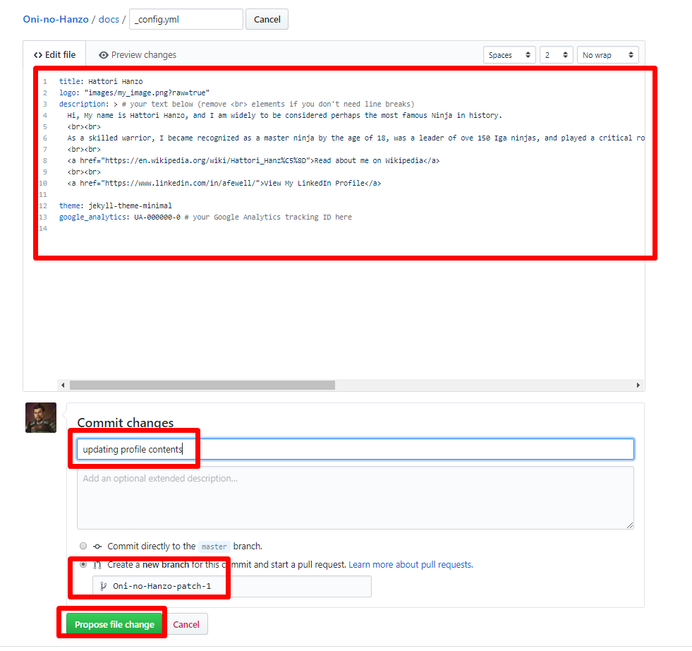

Screenshot 3.3.5.2

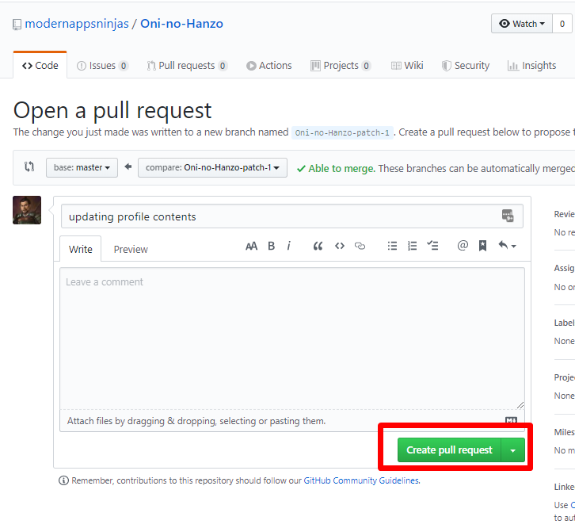

#### 3.3.6 On the PullRequest screen, review your changes, then scroll to the bottom of the pullrequest page and execute the following actions

- Ensure that the value for `pr-build` is `All Tasks have completed executing` 
- In the comment box, type `/approve` and then click the `Comment` button
- Wait for the modernappsninja-jx-bot to process your approval (less than 2 minutes)
- Once the page shows that the merge has been completed, an option to delete branch will appear
- Click `Delete branch`

#### 3.3.7 Open a new browser tab to your github.io portfolio page at https://modernappsninjas.github.io/<yourGithubUsername>. You should see the changes you made in the previous step reflected in your github.io profile page. 

Note it can take up to a few minutes for github to process your changes and show the updates on your page.

#### 3.3.8 On a seperate browser tab, in your github repository, navigate to the `/docs/` folder, click the `index.md` file, and then click the `Raw` button. Observe that the `index.md` page includes some html tags, and the source for the text and images shown on the right hand side of your profile page. Please see the image below for further detail. 

Screenshot 3.3.8.1

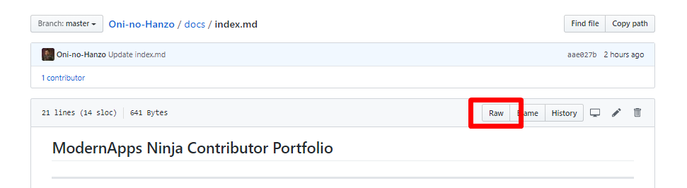

Screenshot 3.3.8.2

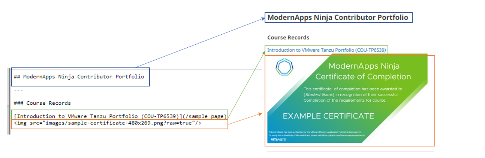

#### 3.3.9 You do not need to update your index.md file at this time. When you complete a course that provides a certificate of completion, the course will provide further details on updating this page to reflect your certificate and other required details. 

## Thank you for completing the Setting up your Modernapps Ninja Contributor Repository Lab Guide!
